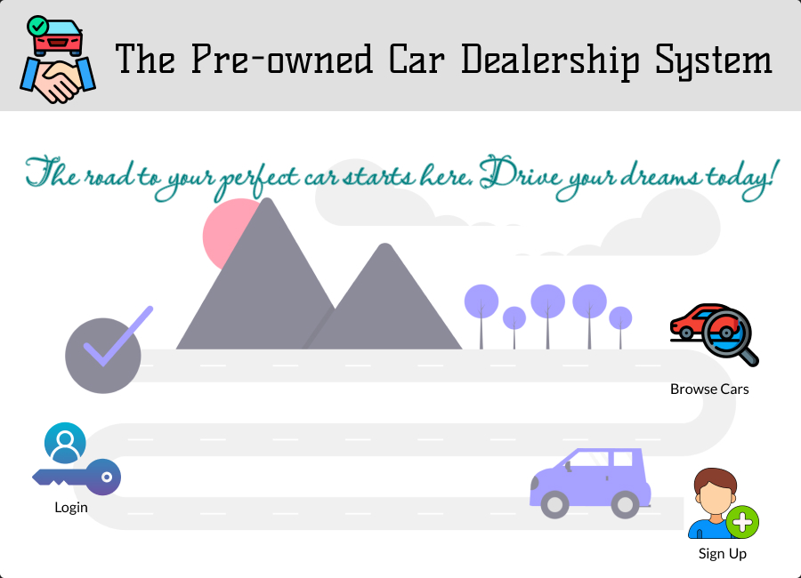

# 🚗 Pre-Owned Car Dealership System (PCDS)

## 📌 Project Overview

The **Pre-Owned Car Dealership System (PCDS)** is a feature-rich, Python-based desktop application developed as part of the BIS698 course at Central Michigan University. It is designed to help **small-scale used car dealerships** efficiently manage their daily operations, including inventory management, test drives, sales processing, customer inquiries, and reviews.

---

## 💡 Problem Statement

Small used car dealerships often rely on **manual processes** for managing their inventory, test drives, sales records, and customer interactions, leading to inefficiencies, errors, and lost sales opportunities. PCDS aims to **automate these workflows** to improve operational efficiency, reduce human errors, and enhance customer experience.

---

## 🎯 Solution

### **Key Features:**

✔️ **Role-Based Access Control**
- **Admin:** Full access to manage cars, sales, test drives, users, and reports.  
- **Staff:** Manage test drives, handle inquiries, moderate reviews, and manage customers.  
- **Customer:** Browse cars, book test drives, send inquiries, make purchases, and submit reviews.

✔️ **Inventory Management**
- Add, update, and manage car listings with detailed specifications and images.

✔️ **Test Drive Scheduling**
- Customers can book, reschedule, or cancel test drives. Staff can manage approvals.

✔️ **Sales Processing & Invoice Generation**
- Admin can process car sales for registered and walk-in customers, generating **professional PDF invoices**.

✔️ **Customer Inquiries & Reviews**
- Customers can submit inquiries and reviews. Staff/Admin can manage and respond efficiently.

✔️ **Reports & Analytics**
- Admin dashboard with KPIs, sales trends, best-selling brands, payment mode splits, and exportable reports in **PDF, Excel, and CSV** formats.

---

## 🔧 Tech Stack

- **Programming Language:** Python
- **GUI Framework:** Tkinter & CustomTkinter
- **Database:** MySQL (with SQLAlchemy ORM integration)
- **Libraries:** Pillow (image handling), Matplotlib & Pandas (reports & analytics), fpdf (PDF invoices)

---

## 🚀 Installation & Setup

1. **Clone this repository:**

```bash
git clone https://github.com/vijay-atla/preowned-car-dealership-management-system.git


```

2. **Navigate to the project directory:**

```bash
cd preowned-car-dealership-management-system

```

3. **Install dependencies:**

```bash
pip install -r requirements.txt
```

4. **Configure database connection:**

- Update db_config in database_utils.py with your MySQL credentials.

```bash
db_config = {
  'host': 'your_host',
  'user': 'your_user',
  'password': 'your_password',
  'database': 'your_database'
}

```
5. **Run the application:**

```bash
python main.py

```

---

## 📸 Screenshots




---

## 👤 Author

- Vijay Atla
Graduate Student, MSIS
Central Michigan University

## 📝 License

- This project was developed for educational purposes as part of BIS698 at CMU. Feel free to fork and customize for learning and academic demonstrations.

